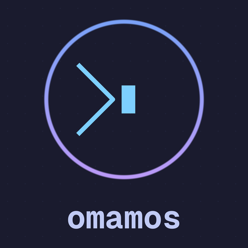

# Omamos

## Overview

Omamos is a shell script automation tool that configures a new macOS machine into a fully working development system in a single command. The name blends "omakase" (お任せ, meaning "I leave it up to you" in Japanese) with "macOS" — a curated, opinionated setup that handles the details so you don't have to.

Inspired by Basecamp's [Omarchy](https://github.com/basecamp/omarchy) and Yatish Mehta's [Omakos](https://github.com/yatish27/omakos).

## Installation

**Quick setup** — run a single command on a fresh Mac:

```bash
curl -L https://raw.githubusercontent.com/thebenwalther/omamos/main/install.sh | bash
```

**Review-first approach** — clone, inspect, then run:

```bash
git clone https://github.com/thebenwalther/omamos.git ~/omamos
cd ~/omamos
bash setup.sh
```

## What Gets Installed

**Command-line tools** — bat, eza, fd, fzf, ripgrep, zoxide, lazygit, lazydocker, gh, dust, btop, glances, tmux, zellij, mise, uv, and more.

**Editors & terminal** — Neovim (LazyVim + Tokyo Night), Zed (Zed Mono, GitHub Dark), Ghostty (JetBrains Mono Nerd Font).

**Applications** — Bitwarden, Brave, Obsidian, Notion, Bear, Discord, Slack, Zoom, Rectangle, Raycast, and a suite of security tools (BlockBlock, KnockKnock, LuLu, Netiquette, SilentKnight).

**Development infrastructure** — Docker, language runtimes via Mise (Bun, Go, Node LTS, Python, Ruby, Zig, ZLS).

**Shell** — Zsh with a structured `~/.zsh/` directory, Starship prompt, fast-syntax-highlighting, zsh-autosuggestions, and zsh-abbr. No Oh-My-Zsh.

**Fonts** — JetBrains Mono Nerd Font, Noto Emoji, Font Awesome Terminal Fonts.

## Key Features

- **Modular** — each script in `scripts/` can run independently for targeted setup
- **Idempotent** — safe to run multiple times; prompts before overwriting existing configs
- **Structured zsh** — `ZDOTDIR` pattern keeps `~` clean, with config split across focused files
- **No Oh-My-Zsh** — Starship handles the prompt; plugins are git-cloned directly

## Structure

```
omamos/
├── install.sh            # One-command installer
├── setup.sh              # Main orchestrator
├── scripts/              # Modular setup scripts
│   ├── brew.sh           # Homebrew packages
│   ├── zsh.sh            # Default shell
│   ├── zshrc.sh          # Zsh config + plugin installation
│   ├── starship.sh       # Starship prompt config
│   ├── git.sh            # Git configuration
│   ├── ssh.sh            # SSH keys and config
│   ├── ghostty.sh        # Ghostty terminal
│   ├── zed.sh            # Zed editor
│   ├── nvim.sh           # Neovim (LazyVim)
│   ├── mise.sh           # Language runtimes
│   └── mac.sh            # macOS system preferences
└── configs/              # Configuration files
    ├── Brewfile           # All packages, casks, fonts, MAS apps
    ├── zshenv             # Sets ZDOTDIR
    ├── zshrc              # Bootstrap (sources ~/.zsh/.zshrc)
    ├── zsh/               # Full zsh config structure
    │   ├── .zprofile      # Homebrew init
    │   ├── .zshrc         # Main config
    │   ├── config/        # envs, init, aliases, history
    │   └── plugins/       # Plugin loader
    ├── ghostty.conf
    ├── starship.toml
    ├── mise.toml
    ├── git/gitconfig
    ├── ssh/config
    ├── zed/settings.json
    └── nvim/              # LazyVim config
```
